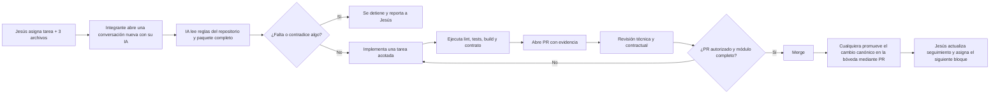

# Contexto — Entrega 01

## Problema que resuelve

El primer riesgo técnico no es una pantalla aislada: es demostrar que cuatro roles y tres repositorios comparten el mismo pedido sin duplicados, cruces de tenant ni estados imposibles. Esta entrega construye esa columna vertebral con el pago menos dependiente de terceros: efectivo.

## Regla de producto

- El pedido existe antes de cobrar y nace en `por_cobrar`.
- Sin sesión de caja abierta el alumno no puede crear pedidos.
- El establecimiento y el rol vienen del contexto autenticado, nunca del body.
- El backend calcula precios y totales con los datos vigentes del catálogo.
- Caja confirma que recibió efectivo y el pedido pasa a `cobrado`.
- Cocina solo ve lo que le corresponde y avanza a `preparando` y `listo`.
- `para_llevar` se entrega en Caja; `en_espacio` se entrega por Mesero.
- Cada acción repetible requiere idempotencia.
- El servidor es la fuente de verdad; los clientes conservan caché únicamente para UX.

## Pantallas de referencia del mockup

Fuente visual: [Demo interactiva de Vaiinilla](http://74.208.167.38/v7/#screen=01).
Usar también el inventario `[[Inventario-Mockup-MVP]]`.

### Catálogo, carrito y creación — VAI-10 / VAI-12

| Ventana | Lo que debe aportar a la implementación |
|---|---|
| [02 — Menú principal](http://74.208.167.38/v7/#screen=02) | Jerarquía del catálogo, saludo, búsqueda, categorías, tarjetas de producto y navegación del alumno |
| [07 — Modal de producto](http://74.208.167.38/v7/#screen=07) | Detalle, opciones, cantidad, precio mostrado y acción para agregar |
| [08 — Producto personalizado](http://74.208.167.38/v7/#screen=08) | Estado visual de opciones seleccionadas y resumen previo |
| [13 — Carrito para llevar y efectivo](http://74.208.167.38/v7/#screen=13) | Productos, cantidades, destino `para_llevar`, método efectivo, totales visuales y confirmación |
| [16 — Pedido confirmado en efectivo](http://74.208.167.38/v7/#screen=16) | Confirmación después de crear el pedido y siguiente acción del alumno |

### Seguimiento y roles operativos — VAI-11 / VAI-13

| Ventana | Lo que debe aportar a la implementación |
|---|---|
| [20 — Pedido por cobrar](http://74.208.167.38/v7/#screen=20) | Estado inicial del seguimiento para efectivo |
| [21 — Pedido cobrado](http://74.208.167.38/v7/#screen=21) | Confirmación visual de cobro |
| [22 — Pedido preparando](http://74.208.167.38/v7/#screen=22) | Preparación en curso |
| [23 — Pedido listo](http://74.208.167.38/v7/#screen=23) | Pedido listo y llamado a recoger/entregar |
| [24 — Pedido entregado](http://74.208.167.38/v7/#screen=24) | Estado final del alumno |
| [32 — Pedido pendiente de cobro](http://74.208.167.38/v7/#screen=32) | Vista de Caja y acción para confirmar efectivo |
| [33 — Entregas en barra](http://74.208.167.38/v7/#screen=33) | Pedidos `para_llevar` listos para entregar en Caja |
| [36 — Sin comandas](http://74.208.167.38/v7/#screen=36) | Estado vacío de Cocina |
| [37 — Pedido cobrado](http://74.208.167.38/v7/#screen=37) | Comanda nueva disponible en Cocina |
| [38 — Preparando](http://74.208.167.38/v7/#screen=38) | Comanda en preparación y transición a listo |
| [39 — Sin mesas esperando](http://74.208.167.38/v7/#screen=39) | Estado vacío de Mesero |
| [40 — Pedido listo para mesa](http://74.208.167.38/v7/#screen=40) | Entrega `en_espacio` y acción de confirmación del Mesero |

El desarrollador abre todas las ventanas de su tarea y entrega los mismos
enlaces a su IA. Si la IA no puede navegar la demo, se le adjuntan capturas
completas. Antes de implementar, la IA debe devolver un mapa
`ventana → pantalla nativa → estado → acción`.

El mockup define composición, jerarquía, navegación y estilo visual. Sus textos
son referencia de microcopy solo cuando usan la terminología canónica. No define
nombres de estados, mensajes funcionales, porcentajes, precios, permisos ni
reglas si contradice `00` a `06` o `CONTRACTS.md`. El PR de frontend incluye
capturas o video comparables contra las ventanas asignadas.

## Flujo de trabajo del equipo

## Qué recibe cada integrante

1. Enlace a su tarea de Notion.
2. Copia o ruta de estos tres archivos.
3. URL del mockup y números de pantalla aplicables.
4. Repositorio, rama base y comandos verificables.
5. Dependencias que deben estar terminadas.

No recibe instrucciones vagas como “construye Pedidos”. Recibe una unidad de 0.5 a 2 días con entradas, salidas y aceptación.

## Responsabilidades en esta entrega

### Jesús — arquitectura y coordinación

- aprobar o corregir el ER y `CONTRACTS.md`;
- vigilar el cumplimiento de las decisiones A1–A8 registradas en `[[03-Decisiones]]`;
- preparar o revisar el diagrama físico que Saúl convertirá en migración;
- asignar tareas y dependencias en Notion;
- revisar cambios de arquitectura y participar en PRs que toquen dinero;
- dirigir la prueba E2E y promover la documentación canónica.

### Saúl — backend

- scaffold Node/Express y CI;
- migración, RLS y seeds del subconjunto de Entrega 01;
- middleware de identidad, tenant y rol;
- catálogo, disponibilidad operativa, pedidos, cobro en efectivo, transiciones, polling y latido;
- idempotencia y control de concurrencia;
- OpenAPI y pruebas unitarias, integración y contrato.

### David — Android/Kotlin

- scaffold Kotlin/Compose y CI;
- modelos y cliente HTTP generados o validados contra OpenAPI;
- catálogo, detalle, carrito, destino, efectivo, confirmación y seguimiento;
- vistas operativas necesarias para demostrar los roles si forman parte del mismo binario MVP;
- persistencia de sesión/caché sin decidir dinero localmente;
- pruebas de ViewModel/repositorio y contrato.

### Mack — iOS/Swift

- scaffold Swift/SwiftUI y CI;
- modelos `Codable` y cliente HTTP validados contra OpenAPI;
- paridad funcional con Android en catálogo, carrito, checkout y seguimiento;
- vistas operativas necesarias para la demostración;
- persistencia segura de sesión y caché;
- pruebas de stores/repositorios y contrato.

## Secuencia de integración

1. Todos trabajan con los mismos fixtures y ejemplos de `CONTRACTS.md`.
2. Saúl publica OpenAPI y ambiente de desarrollo estable.
3. Android e iOS cambian su implementación de repositorio simulado a remoto sin cambiar las vistas.
4. Se ejecuta el mismo caso feliz y la misma matriz negativa en los tres repositorios.
5. Solo después se realiza la demo conjunta.

## Caso E2E obligatorio

1. Caja abre sesión con monto inicial.
2. Alumno obtiene disponibilidad y catálogo.
3. Alumno agrega un producto con opciones y crea pedido en efectivo para llevar.
4. Repetir el request con la misma llave devuelve el mismo pedido.
5. Caja ve el pedido y confirma efectivo.
6. Cocina lo ve, inicia preparación y marca listo.
7. Caja entrega y el alumno ve `entregado`.
8. Repetir una transición no crea otro evento ni cambia totales.
9. Repetir el flujo con destino a espacio hace que Mesero, no Caja, confirme entrega.
10. Un token de otro establecimiento no puede leer ni mutar el pedido.

## Reporte final de cada IA

La IA debe devolver:

- archivos modificados;
- comportamiento implementado;
- comandos ejecutados y resultado;
- pruebas añadidas;
- supuestos no realizados;
- bloqueos o diferencias contra el contrato;
- riesgos pendientes;
- URL o identificador del PR si existe.
